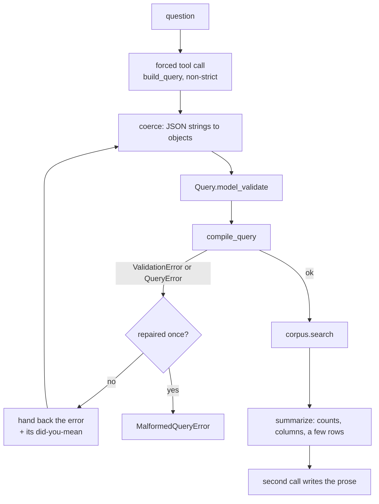

# Natural-language search over the ORD corpus — design

- **Date:** 2026-08-17
- **Author:** Steven Kearnes
- **Status:** draft, for review
- **License:** [CC-BY-SA-4.0](https://creativecommons.org/licenses/by-sa/4.0/)

The measurements this argues from are in [the entry beside it](../README.md). Read finding
1–4 before proposing constrained decoding again; it was tried four ways and does not fit.

## What this builds

A question in English becomes a validated `Query`, runs against a `Corpus`, and comes back
with the reactions and a sentence saying what they show. One entry point:

```python
from ord_schema.search import execute, nl

corpus = execute.Corpus("projections/*/*.parquet", "structures/*/*.parquet")
answer = nl.ask("which reactions use pyridine as a solvent and beat 50% yield?", corpus)

answer.query   # the Query that ran, for display and for a "run it again" button
answer.table   # pyarrow.Table, exactly what corpus.search returned
answer.text    # "1,204 reactions. Most are Suzuki couplings; yields cluster at 60-75%."
```

`ask` is the whole public surface. `translate` and `answer` are separable because the eval
harness needs the first without the second, and a caller that renders its own results
needs the first without the third.

## What it does not build

- **Multi-turn.** No clarifying questions, no follow-ups, no session state. A question is
  answered or it fails.
- **A second backend.** Corpus only. ord-interface's Postgres path is out of scope, and
  the broken `ord_schema.agent.nl_query` import there is a separate cleanup.
- **Constrained decoding.** Measured dead; see the entry.
- **Text search tuning.** Substring predicates remain expressible and remain unoptimized.

## The gap this depends on

`Measure` and `Order` require a scalar path, so an aggregate cannot reach a value under a
repeated level:

```text
outcomes.products.measurements.percentage.value: max needs a scalar column, not a repeated level
```

"The ten highest-yielding reactions" is therefore unwritable, and both models tried to
write it anyway. **Task 1 closes this before any NL code exists**, because a layer built
over the gap would answer the question wrongly rather than refuse it.

The shape: a reduction over a repeated path, usable wherever a scalar is wanted.

```json
{"order_by": [{"key": {"reduce": "max", "path": "outcomes.products.measurements.percentage.value"}, "descending": true}],
 "limit": 10}
```

It compiles to a list aggregate over the reaction's own elements — `list_max(list_transform(...))`
over the projection, or `max(...)` over the level's pivot with a correlated subquery — so
it inherits the routing the executor already does per quantifier. `min`, `max`, `avg`,
`sum`, and `count` all make sense; `count` needs no path.

Filtering on a reduction (`reactions whose best yield beats 50%`) is already expressible as
`exists ... where percentage.value > 50`, and stays that way. This is only about ordering
and aggregating, where there is no quantifier to hang the condition on.

## How translation works



**The cached prefix** is the system text (instructions plus `schema.describe()`) and the
tool definition, marked `cache_control: {"type": "ephemeral", "ttl": "1h"}`. Measured at
15,481 tokens on Opus and 11,462 on Haiku, read at a tenth of list price on every call
after the first. Two rules keep it cached: nothing volatile goes in the prefix (no
timestamps, no per-request identifiers), and the tool list is built once at import.

**The coercing parse** walks the tool input and replaces any string that parses as JSON
with the parsed value, because both models return the predicate tree as a JSON string
(finding 5). It runs before pydantic, and it is not a fallback — it is the normal path.

**One repair turn.** On a validation or compile failure, the assistant's tool call and a
`tool_result` carrying the error text go back with `is_error: true`. The compiler's errors
already name the bad path and suggest a real one, which is what makes this worth doing;
Haiku recovers two of five failures on it. A second failure raises rather than looping —
an unbounded repair loop spends real money discovering the model cannot answer.

**The answer call** sees a summary, never the table: row count, column names, and up to
five sample rows rendered as text. A result set of 100,000 reactions costs the same
prompt as one of three.

## Module layout

| file | holds |
| --- | --- |
| `ord_schema/search/nl.py` | `ask`, `translate`, `answer`, the client, the errors |
| `ord_schema/search/nl_prompt.md` | the system prompt, as markdown rather than a Python string |
| `ord_schema/search/nl_eval.py` | `EvalCase`, `load_cases`, scoring, the report |
| `ord_schema/search/nl_cases.yaml` | the eval set, versioned beside the prompt it grades |

`nl.py` sits in `search/` because it depends on the grammar, the compiler, and the
executor, and nothing else depends on it. The prompt lives beside it for the reason the
old branch found: a prompt in a markdown file can be edited and diffed as prose.

Dependencies: a new `nl` extra carrying `anthropic`, since `ord-schema[search]` must stay
installable without it. `ord_schema/dependencies_test.py` gains a profile row, which is
what keeps that promise honest.

## Errors

The names come from the `nl-query-backend` branch, because ord-interface already maps them
to status codes and there is no reason to invent new ones:

| error | when |
| --- | --- |
| `ModelRateLimitedError` | 429 from the API |
| `ModelUnavailableError` | 5xx, timeout, connection failure |
| `MalformedQueryError` | still invalid after the repair turn |

All three inherit `NLQueryError`. Everything else propagates: a `PairingError` from the
corpus is not the model's fault and should not be dressed up as one.

## Testing

**Unit tests take no network.** A fake client returns canned tool calls, which is enough
to pin every behavior that matters: the coercion, the repair turn firing exactly once, the
error taxonomy, the prefix being marked cacheable, and the summary staying bounded as the
table grows.

**The eval harness is opt-in and costs money.** `nl_eval.py` runs cases against a real
model and reports first-try and after-repair rates, per-question failures, and token cost.
A case states a question and what the answer must satisfy — not a `Query` literal, since
several spellings are right:

```yaml
- question: reactions using pyridine as the solvent
  compiles: true
  must_return: [ord-1f2a..., ord-9c7e...]   # reactions any correct query returns
  must_not_return: [ord-4b81...]            # a near-miss the wrong quantifier would include
```

Scoring on returned reactions rather than on query shape is what makes the harness able to
say a translation is *wrong* rather than merely *different*. The cases live beside the
prompt so that changing one and not the other shows up in review.

## What "fast" means here

A question costs one translation call, one execution, and one answer call. The middle term
is the only one this repository controls, and it is already measured: a structure query
lands in 0.02–1.5 s warm, a quantifier over a pivot in tens of milliseconds. Translation is
seconds and dominated by output tokens; the answer call is shorter.

So the latency work is not in this layer, and the design should not pretend otherwise. What
this layer owes the corpus is *not making it slow*: no query without a limit, the timeout
passed through to `corpus.search`, and the model never handed enough rows to think it should
summarize them itself.

## Open questions

1. **Which model.** Ten questions say Opus 9/10 and Haiku 7/10 at 5.6× less. The eval set
   decides, and the interesting variable is whether worked path examples in the cached
   prefix close the gap — they are nearly free once cached.
2. **Whether the path enum earns a place.** Enumerating all 431 scalar paths fits a depth-2
   grammar and makes invented paths impossible. If the evals show shallow queries dominate
   real traffic, a constrained fast path with an unconstrained fallback becomes tempting —
   but it is two systems, and it needs the traffic to justify it.
3. **Where `/ask` lands.** Out of scope here, and the answer probably changes once the
   layer exists and ord-interface's dependency on the deleted module is cleaned up.
